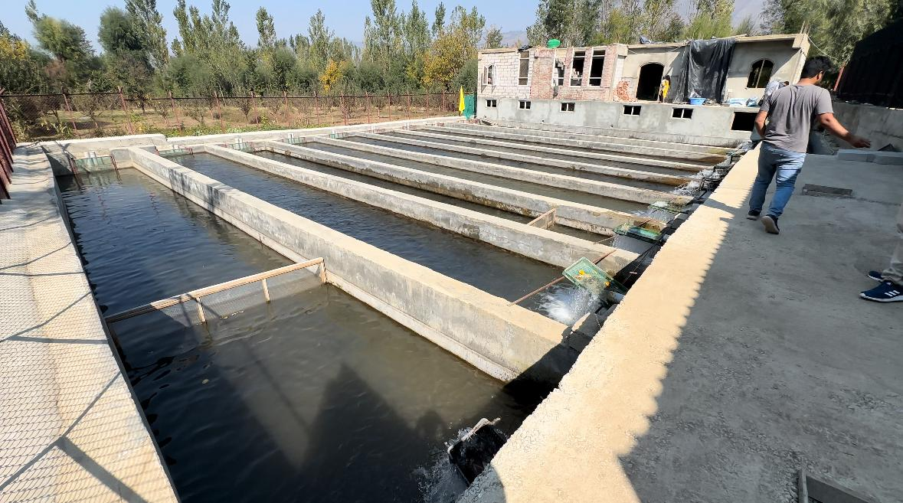

# Trout Farm Design and Implementation

The following design was made using Autodesk Revit software. The design contain a number of features including races in which trout fishes are grown and fed and a small house at the end of the piece of land. The house also contains a basement where facilities for hatchery are to be constructed.

Front View

Top view

Actual Construction